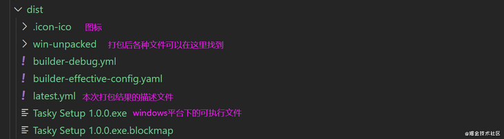
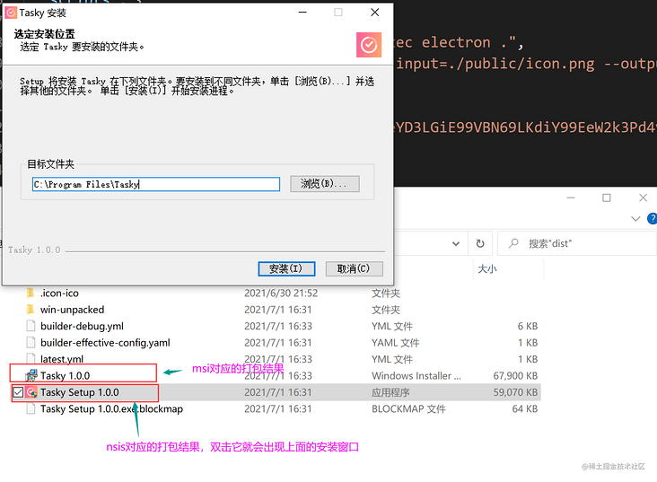
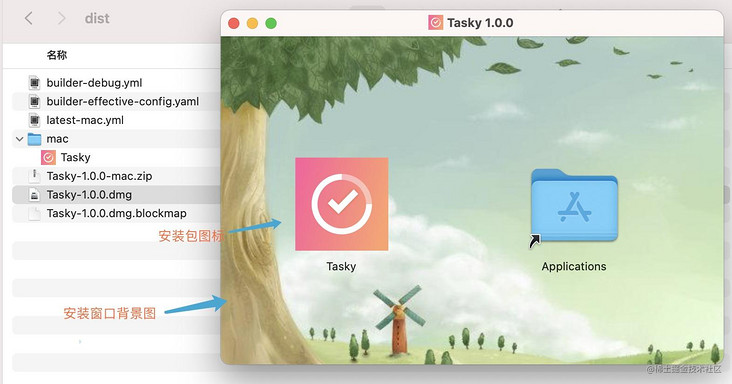

# 完整的第一课， 编写一个程序并编译成发行版本


1. 安装依赖

```
npm install electron --save-dev

```

2. 编写 main.js  和 index.html

main.js

````js
const {app, BrowserWindow} = require('electron'); 

let mainWindow;
const createWindow = ()=>{
    mainWindow = new BrowserWindow({
        width:800,
        height: 600
    });

    mainWindow.loadFile('./index.html');
}

app.whenReady().then(()=>{
    createWindow();

    app.on('activate', () => {
        if (BrowserWindow.getAllWindows().length === 0) createWindow()
    });    
});

  //在Windows和Linux上，关闭所有窗口 完全退出一个应用程序
  app.on('window-all-closed', () => {
    if (process.platform !== 'darwin') app.quit();// macOS 使用 quit 命令退出应用程序
  });

````

index.html

```
<!DOCTYPE html>
<html lang="en">
<head>
    <meta charset="UTF-8">
    <meta http-equiv="X-UA-Compatible" content="IE=edge">
    <meta name="viewport" content="width=device-width, initial-scale=1.0">
    <title>electron 的第一个程序</title>
    <link rel="stylesheet" href="index.css">
</head>
<body>
    <div class="title">
        入门electron
    </div>
</body>
</html>

```


3. 编译运行 

在package.json 里面写 

```
  "scripts": {
    "build": "electron  main.js"
  },

```

直接运行命令

```
    npm run build

```

如果你写的命令是

````
 "build": "node_modules/.bin/electron  main.js"

````
结果出现了下面的提示：

'node_modules' 不是内部或外部命令，也不是可运行的程序

只需要把地址去掉即可
````
 "build": "electron  main.js"

````

4. 打包

Electron生态下常用的打包工具有两个：electron-builder 和 electron-packager。

基于 electron-builder的打包

（1） 安装工具

```
npm i electron-builder --D

```

使用electron-builder打包主要是各种配置，它支持两种配置方式：

在package.json中添加build字段：

window程序的配置

```
"build": {
  ...
  "win": {
    "target": ["msi","nsis"],        //安装包的格式，默认是"nsis"  //"target"值"nsis"打包出来的就是exe文件
    "icon": "build/icons/icon.ico"   //安装包的图标, 这个图标必须是ico格式的
  },
  
  
  //nsis是windows系统安装包的制作程序，它提供了安装、卸载、系统设置等功能
  //关于"nsis"的一些配置
  "nsis": {                          
    "oneClick": false,               //是否一键安装，默认为true
    "language": "2052",              //安装语言，2052对应中文
    "perMachine": true,              //为当前系统的所有用户安装该应用程序
    "allowToChangeInstallationDirectory": true   //允许用户选择安装目录
  }
}

```
windows下打包完成如下： 



安装过程如下：




Mac 下的应用程序配置 

```
...
"build": {
    "mac": {
        "target": ["dmg", "zip"],       //安装包的格式，默认是"dmg"和"zip"
        "category": "public.app-category.utilities"  //应用程序安装到哪个分类下，具体有哪些分类可以在苹果官网上找
    },
    "dmg": {
        "background": "build/background.jfif",   //安装窗口背景图
        "icon": "build/icons/icon.icns",         //安装图标
        "iconSize": 100,                         //图标的尺寸
        "contents": [                            //安装图标在安装窗口中的坐标信息
            {
            "x": 380,
            "y": 180,
            "type": "link",
            "path": "/Applications"
            },
            {
            "x": 130,
            "y": 180,
            "type": "file"
            }
        ],
        "window": {
            "x":100,   // 启动后窗口左上角位置
            "y":100,                            
            "width": 540,//安装窗口的大小
            "height": 380
        }
    }
}

```

生成的mac安装程序如下：




 ### electron-builder会自动识别当前的操作系统，打出系统对应的安装包。 
 ### 这也意味着，如果要生成exe\msi，需要在Windows操作系统，如果是dmg，则需要在Mac操作系统


## asar


会将哪些文件pack到安装包
在打包生成的文件夹中，会有一个app.asar，它是Electron应用程序的主业务文件压缩包，要知道项目中哪些文件被pack到安装包，可以通过解压app.asar进行查看。

```
解压app.asar需要借助asar工具，首先来安装：npm i asar -g 

```